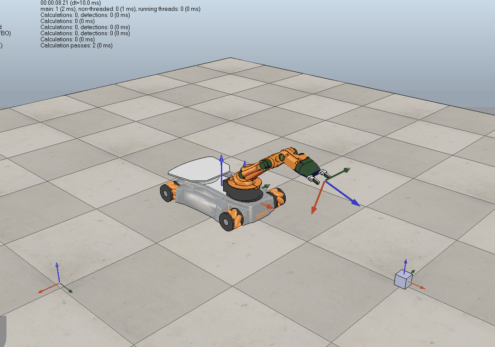

# Modern Robotics Capstone - KUKA youBot

In this capstone project, I wrote software that plans a trajectory for the end-effector of the youBot mobile manipulator (a mobile base with four mecanum wheels and a 5R robot arm), performs odometry as the chassis moves, and performs feedback control to drive the youBot to pick up a block at a specified location, carry it to a desired location, and put it down. For more details, please visit [the Modern Robotics wiki](http://hades.mech.northwestern.edu/index.php/Mobile_Manipulation_Capstone).

## Milestones & Key Concepts 

### Key Milestones:

1. Position Simulation with joint speeds

   In this milestone project, I wrote a simulator for the kinematics of the youBot. The main function in the simulator, `NextState`, generates the position and angle of the robot. 

2. Reference Trajectory Generation

   For this milestone I wrote a function `TrajectoryGenerator` to generate the reference trajectory for the end-effector frame {e}. This trajectory consists of eight concatenated trajectory segments, as described below. Each trajectory segment begins and ends at rest.
   Segment 1: A trajectory to move the gripper from its initial configuration to a "standoff" configuration a few cm above the block.
   Segment 2: A trajectory to move the gripper down to the grasp position.
   Segment 3: Closing of the gripper.
   Segment 4: A trajectory to move the gripper back up to the "standoff" configuration.
   Segment 5: A trajectory to move the gripper to a "standoff" configuration above the final configuration.
   Segment 6: A trajectory to move the gripper to the final configuration of the object.
   Segment 7: Opening of the gripper.
   Segment 8: A trajectory to move the gripper back to the "standoff" configuration.

3. Wheel and joint speed control

   I experimented with feedback control of the mobile manipulator and wrote the function `FeedbackControl` to calculate the kinematic task-space feedforward plus feedback control law, written both as Equation (11.16) and (13.37) in the book [Modern Robotics](http://modernrobotics.org/).

4. Visualization on V-REP

   I designed a the software to drive the youBot to transport a solid cubic. The details are shown in the above gif video.

### Key Concepts:

1. Straight line trajectory generation with time scaling
2. Forward kinematics using screw theory and Lie algebra
3. Omnidirectional robot wheel speed calculation
4. Velocity Kinematics using Jacobian for calculating robot arm joint speeds
5. PD+Feedforward for end-effector position control
6. V-REP Physics Engine

## Reference

- [Modern Robotics](http://modernrobotics.org/)

